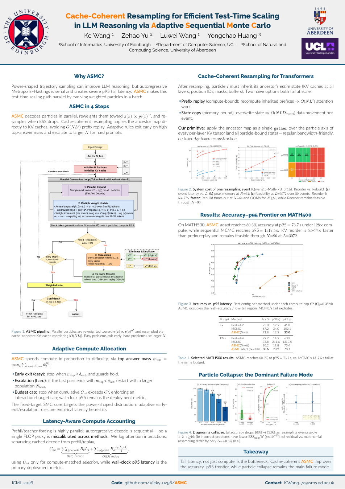

# Cache-Coherent ASMC

### Adaptive Sequential Monte Carlo for Sequence-Level Power Sampling in LLMs

Official implementation of the ICML 2026 paper:

**Cache Coherent Resampling for Efficient Test Time Scaling in LLM Reasoning
via Adaptive Sequential Monte Carlo**

[Paper](https://openreview.net/pdf?id=JN6wxUGmW8) · [Project Page](https://vicky-0256.github.io/ASMC/) ·
[Poster](#poster) · [Citation](CITATION.cff)

---

## What is ASMC?

ASMC is a training-free particle inference method for sequence-level power
sampling. It replaces a serial trajectory-level Markov chain with a parallel
population of particles and adapts the population to problem difficulty.

## Sequence-level Power Sampling

For a prompt $c$ and complete generated trajectory $x$, ASMC targets the
normalized power distribution

$$
\pi_\alpha(x \mid c)
= \frac{p_\theta(x \mid c)^\alpha}
       {\sum_{x'} p_\theta(x' \mid c)^\alpha},
\qquad \alpha > 1.
$$

This is different from token-wise temperature scaling. With
$T=1/α$, token temperature sampling gives

$$
q_T(x \mid c)
= \prod_{t=1}^{|x|}
\frac{p_\theta(x_t \mid x_{<t},c)^\alpha}
     {\sum_v p_\theta(v \mid x_{<t},c)^\alpha}.
$$

The two distributions are generally not the same because token-wise
normalization depends on the generated prefix. This complete-trajectory target
is the reason ASMC is a sequence-level power-sampling method rather than a
low-temperature decoder.

## Algorithm

ASMC combines:

- GPU-parallel Sequential Monte Carlo;
- ESS-triggered particle resampling;
- cache-coherent KV-state reordering;
- adaptive particle allocation; and
- particle-collapse diagnostics.

[](https://vicky-0256.github.io/ASMC/)

The figure is `fig:asmc` from the camera-ready paper. The
[interactive ASMC explainer](https://vicky-0256.github.io/ASMC/) provides the
animated particle, ESS, resampling, and KV-cache walkthrough.

> **Reproducibility note.** The public release contains corrected ASMC
> execution and auditing paths. Some historical camera-ready operating points
> are undergoing corrected GPU reruns. Detailed scope and integrity status are
> documented in [Reproducibility and Result Integrity](docs/result_integrity.md).

## Quick Start

Install Python 3.10 or 3.11 dependencies:

```bash
python3 -m venv .venv
source .venv/bin/activate
python -m pip install --upgrade pip
python -m pip install -e .
```

The smoke profile uses PyTorch SDPA and does not require FlashAttention. The
full GPU campaign uses FlashAttention 2; install a compatible build separately
when needed:

```bash
python -m pip install "flash-attn>=2.6,<3" --no-build-isolation
```

Run one MATH500 problem with a deliberately small population:

```bash
python asmc_full_comparison.py \
  --save_str results/smoke \
  --model qwen_math \
  --attn_implementation sdpa \
  --dataset MATH \
  --cot \
  --batch_idx 0 \
  --n_problems 1 \
  --seed 0 \
  --max_tokens 256 \
  --n_particles 4 \
  --block_size 32 \
  --ess_threshold 0.5 \
  --epsilon 0.05 \
  --alpha_start 1.5 \
  --anneal_tokens 64 \
  --fixed \
  --run_asmc \
  --use_batched
```

This is a functional smoke test, not a paper-quality evaluation. The public
default does not enable the historical stop-token constraints; use
`--legacy_stop_constraints` only for an explicitly labelled protocol-inspection
run.

## Python API

The sampler is also a reusable method library. This minimal example loads the
public Qwen checkpoint, runs one prompt, and returns the weighted ASMC answer:

```python
import torch
from transformers import AutoModelForCausalLM, AutoTokenizer
from asmc import ASMCConfig, BatchedASMCSampler

model_id = "Qwen/Qwen2.5-Math-7B"
tokenizer = AutoTokenizer.from_pretrained(model_id)
model = AutoModelForCausalLM.from_pretrained(
    model_id, torch_dtype=torch.bfloat16, device_map="auto"
)
prompt_ids = tokenizer("Solve: 2 + 2 = ?", return_tensors="pt").input_ids[0].tolist()
config = ASMCConfig(
    n_particles=4,
    block_size=32,
    max_new_tokens=256,
    alpha_star=4.0,
)
sampler = BatchedASMCSampler(model, tokenizer, device=model.device)
particles, answer, best_particle, diagnostics = sampler.sample(prompt_ids, config)
completion = tokenizer.decode(best_particle.tokens[len(prompt_ids):], skip_special_tokens=True)
print(answer, completion)
```

Use `enable_adaptive=True` for the fast/hard population policy. The actual
configuration field is `alpha_star` (the target exponent), and `sample()`
returns particles, the voted answer, the best particle, and diagnostics.

## Cache-Coherent Resampling

At a resampling boundary, ASMC gathers each ancestor's KV-cache slices and
particle-bound state directly. It avoids replaying every inherited prefix, so
the resampling update scales with the particle population and cached sequence
length rather than repeating the full prefix computation. The optional
[`microbench/cache_resampling.py`](microbench/cache_resampling.py) benchmark
isolates this cache-reorder path.

The low-level primitive is available without invoking the sampler:

```python
from asmc.cache import reorder_past_key_values

past_key_values = reorder_past_key_values(past_key_values, ancestor_indices)
```

It supports both Transformers `DynamicCache` objects and legacy tuple caches;
the same ancestor mapping must be applied to every particle-bound state.

## Reproducing the Paper

The supported public artifact is ASMC on MATH500, not a full baseline/table
reproduction. The release workflow is:

1. run the smoke test above;
2. declare a fixed or adaptive configuration and run five disjoint 100-problem
   shards with [`scripts/run_asmc_only.sh`](scripts/run_asmc_only.sh); and
3. audit the five CSV shards with `analysis/result_audit.py --method asmc`.

The full commands, model revision, manifest schema, adaptive cap, SLURM
templates, and acceptance criteria are in
[`docs/reproducibility.md`](docs/reproducibility.md). Compute definitions and
timing semantics are in [`docs/benchmarking.md`](docs/benchmarking.md); the
historical protocol and evidence boundary are in
[`docs/result_integrity.md`](docs/result_integrity.md).

The current repository contains corrected code and CPU tests, but no corrected
500-problem GPU rerun. Historical camera-ready numbers are therefore not
claimed as reproduced.

## Relation to Prior and Concurrent Work

ASMC builds on probabilistic inference and sequence-level sampling for
autoregressive language models.

### Power Sampling for LLM Reasoning

Karan and Du, [*Reasoning with Sampling: Your Base Model is Smarter Than You
Think*](https://arxiv.org/abs/2510.14901) (ICLR 2026 Oral), introduced the power
distribution as a training-free target for LLM reasoning:

$$
\pi_\alpha(x \mid c) \propto p_\theta(x \mid c)^\alpha,
\qquad \alpha > 1.
$$

They showed why this sequence-level target differs from token-wise
low-temperature sampling and used autoregressive Metropolis-Hastings/MCMC to
approximately sample it. ASMC adopts the same objective but addresses a
different bottleneck: it replaces the serial chain with a GPU-parallel
population of weighted particles, adaptive particle allocation, and
cache-coherent Transformer KV-state resampling.

### Sequential Monte Carlo for Language Models

Zhao et al., [*Probabilistic Inference in Language Models via Twisted
Sequential Monte Carlo*](https://proceedings.mlr.press/v235/zhao24c.html) (ICML
2024), established SMC as a framework for language-model inference under
unnormalized sequence-level targets. Their learned twist functions estimate
future potentials to guide partial sequences. ASMC instead defines its internal
target solely from the base-model likelihood through
$p_\theta(x \mid c)^\alpha$, without an external reward or learned twist.

### Concurrent Particle Power Sampling

[Power-SMC](https://arxiv.org/abs/2602.10273) (Azizi et al., 2026) is concurrent
work that also applies SMC to the global sequence-level power distribution.
Both methods target complete-trajectory power sampling and replace serial MCMC
with GPU-parallel particles. They emphasize complementary aspects:

- ASMC: adaptive fast-to-hard allocation, cache-coherent KV/state resampling,
  deployment-oriented p50/p95 latency, and particle-collapse diagnostics;
- Power-SMC: prefix-only proposal analysis, Rényi-entropy characterization of
  weight instability, and exponent-bridging proposal stabilization.

We view ASMC and Power-SMC as concurrent and complementary approaches to
efficient sequence-level power sampling. Full related-work BibTeX entries are
in [`docs/related_work.md`](docs/related_work.md).

## Poster

The project poster is displayed below. Click the preview to open the original
PDF at full resolution.

<p align="center">
  <a href="AMSC_poster.pdf">
    
  </a>
</p>

## Citation

If you use ASMC, sequence-level power sampling, or cache-coherent resampling,
please cite the accompanying paper. Copy this BibTeX entry directly:

```bibtex
@inproceedings{wang2026cache,
  title={Cache Coherent Resampling for Efficient Test Time Scaling in LLM Reasoning via Adaptive Sequential Monte Carlo},
  author={Wang, Ke and Yu, Zehao and Wang, Luwei and Huang, Yongchao},
  booktitle={Forty-third International Conference on Machine Learning}
}
```

Machine-readable citation metadata is also available in
[`CITATION.cff`](CITATION.cff).

## License

This repository's original code is released under the [MIT License](LICENSE).
Dataset, model, and third-party-code terms remain independent of the software
license; see [`data/README.md`](data/README.md) for dataset provenance and
redistribution notes.
