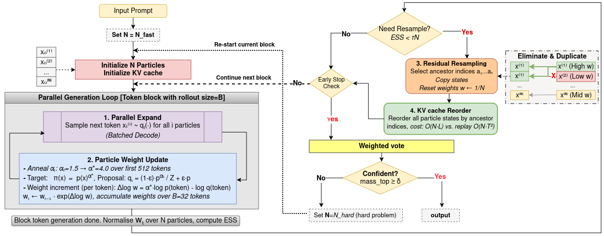

# Cache Coherent Resampling for Efficient Test Time Scaling in LLM Reasoning via Adaptive Sequential Monte Carlo

Official implementation accompanying the paper by Ke Wang, Zehao Yu, Luwei Wang, and Yongchao Huang.

ASMC replaces a serial trajectory-level Markov chain with a parallel population of particles. Its cache-coherent resampling path applies each ancestor mapping directly to the particles' KV caches, avoiding full prefix replay after resampling.

> **Release status: ASMC-only pre-release.** The public artifact is scoped to
> running and auditing the corrected fixed and adaptive ASMC protocols on
> MATH500. It does not promise reproduction of the paper's baselines,
> compute-matched comparison table, Appendix C, or every figure. The repository
> does not yet contain a corrected GPU rerun, so the camera-ready ASMC numbers
> are **not reproduced or verified here**. See
> [Result-integrity status](#result-integrity-status) and
> [the ASMC reproducibility guide](docs/reproducibility.md).

## Interactive explainer and algorithm overview

The companion webpage from the `page` branch is deployed at
[vicky-0256.github.io/ASMC](https://vicky-0256.github.io/ASMC/). It contains the
full interactive particle, ESS, resampling, and KV-cache walkthrough. Click the
algorithm walkthrough below to open the interactive page:

[](https://vicky-0256.github.io/ASMC/)

This is the algorithm overview figure from the camera-ready paper
(`fig:asmc`); the linked webpage provides the interactive version. The webpage
and its historical figures are explanatory material, not a claim that the old
paper numbers have been reproduced. The release status and audited ASMC path
above remain authoritative.

## What is included

- `asmc_sampler.py`: reference ASMC implementation and answer-level voting.
- `asmc_batched.py`: batched decoding and cache-coherent KV-cache reordering.
- `asmc_full_comparison.py`: MATH500 runner; the supported release path enables
  ASMC alone.
- `compute_tracker.py` and `compute_instrumentation.py`: inference-compute accounting.
- `analysis/result_audit.py`: strict validation and configuration-level aggregation of MATH500 result shards.
- `analysis/select_compute_matched.py` and
  `analysis/render_compute_table.py`: optional comparison utilities retained
  for research use; they are outside the ASMC-only release contract.
- `microbench/cache_resampling.py`: CUDA-event benchmark for KV-cache reorder versus full prefix replay.
- `grader_utils/`: answer parsing and evaluation helpers.
- `data/MATH500.json`: the 500-example MATH evaluation subset used by the runner; provenance notes are in [`data/README.md`](data/README.md).
- `scripts/`: cluster submission templates. Inspect all resource, environment, and output settings before submitting them on a new cluster.

Baseline implementations such as Best-of-N, MCMC, greedy decoding, and
majority vote remain in the repository as unsupported research utilities.
They are not required to install, smoke-test, run, or audit ASMC, and their
paper results are outside the public artifact's success criteria. HumanEval,
GSM8K, comparison-table rendering, and publication plotting are likewise out
of scope. The cache microbenchmark CLI is included as an optional ASMC systems
diagnostic, but its reviewed paper-result artifact is not yet published.

## Installation

Python 3.10 or 3.11 on Linux is recommended. Create an isolated environment from this directory:

```bash
python3 -m venv .venv
source .venv/bin/activate
python -m pip install --upgrade pip
python -m pip install -r requirements.txt
```

The direct runner and `scripts/run_asmc_only.sh` full profile default to
FlashAttention 2. The script's smoke profile defaults to PyTorch SDPA, and the
direct smoke command below requests SDPA explicitly, so the smoke path does
not require the optional `flash-attn` package. Before a full campaign, install
a FlashAttention build compatible with the installed PyTorch/CUDA stack, for
example:

```bash
python -m pip install "flash-attn>=2.6,<3" --no-build-isolation
```

`requirements.txt` pins the tested Transformers 4.46.3 cache API and gives
compatibility ranges for the remaining packages; it is not a bit-for-bit
environment lock. Before an archival result release, record the exact Python,
PyTorch, CUDA, driver, FlashAttention, and transitive-package versions in the
run manifest.

Confirm that the command-line entry point imports successfully:

```bash
python asmc_full_comparison.py --help
python -m unittest discover -s tests -v
```

## Quick start

The following command runs one MATH500 problem with a deliberately small particle population. It is a functional smoke test, not a paper-quality evaluation:

```bash
python asmc_full_comparison.py \
  --save_str results/smoke \
  --model qwen_math \
  --attn_implementation sdpa \
  --dataset MATH \
  --cot \
  --batch_idx 0 \
  --n_problems 1 \
  --seed 0 \
  --max_tokens 256 \
  --n_particles 4 \
  --block_size 32 \
  --ess_threshold 0.5 \
  --epsilon 0.05 \
  --alpha_start 1.5 \
  --anneal_tokens 64 \
  --fixed \
  --run_asmc \
  --use_batched
```

The public default protocol does **not** apply the historical ASMC-only
minimum-length/stop-token constraint. Historical paper runs used that
behavior. Use `--legacy_stop_constraints` only for an explicitly labelled
protocol-inspection run; it is not part of the corrected public default and
does not make the old paper results reproducible. The corrected release will
publish separate fixed (`--fixed`) and adaptive (`--adaptive`) ASMC
configurations and audited result manifests.

In adaptive mode, `--n_particles N` denotes the hard-pass population and the
fast pass uses `N/2` particles by default. `--hard_n_particles` is available
only for explicitly documented ablations.

## ASMC-only reproduction path

The supported public path has three stages:

1. run the one-problem fixed-ASMC smoke command above;
2. run five MATH500 shards for each declared fixed or adaptive ASMC
   configuration with `scripts/run_asmc_only.sh` (or the equivalent direct
   runner command); and
3. audit each five-shard configuration with
   `analysis/result_audit.py --method asmc`, producing a content-addressed
   summary.

For a SLURM campaign, submit the five fixed shards and then the five adaptive
shards. The runner defaults Qwen2.5-Math-7B to the immutable public-release
snapshot `8daf1d676c3f24ddec5a99c5cff00a5c0e1c441c`; keep that revision (or
explicitly predeclare a different immutable commit) and choose the adaptive
cap before launching:

```bash
ASMC_MODEL_REVISION=8daf1d676c3f24ddec5a99c5cff00a5c0e1c441c \
ASMC_MODE=fixed \
ASMC_RESULTS_DIR=results/runs/math500/fixed_n64 \
ASMC_N_PARTICLES=64 \
ASMC_ANNEAL_TOKENS=1024 \
./scripts/submit_all.sh asmc_only \
  --account=REPLACE_WITH_ACCOUNT --partition=REPLACE_WITH_GPU_PARTITION

ASMC_MODEL_REVISION=8daf1d676c3f24ddec5a99c5cff00a5c0e1c441c \
ASMC_MODE=adaptive \
ASMC_RESULTS_DIR=results/runs/math500/adaptive_n128 \
ASMC_N_PARTICLES=128 \
ASMC_HARD_N_PARTICLES=128 \
ASMC_ANNEAL_TOKENS=1536 \
ASMC_HARD_ANNEAL_TOKENS=768 \
ASMC_HARD_ALPHA_START=1.3 \
ASMC_HARD_ESS_THRESHOLD=0.6 \
ASMC_C_INT_CAP=REPLACE_WITH_NUMERIC_CAP \
./scripts/submit_all.sh asmc_only \
  --account=REPLACE_WITH_ACCOUNT --partition=REPLACE_WITH_GPU_PARTITION
```

These are campaign templates, not evidence that the displayed paper operating
points have already been reproduced. Record every intended configuration and
cap in a committed sweep manifest before launching. The exact five-shard audit
command and acceptance criteria are in
[`results/paper/README.md`](results/paper/README.md).

## Release scope

| Artifact | Supported public path | Status |
| --- | --- | --- |
| Fixed cache-coherent ASMC on MATH500 | ASMC-only runner -> strict ASMC audit | Code path available; corrected 500-problem GPU artifact pending |
| Adaptive cache-coherent ASMC on MATH500 | ASMC-only runner with a predeclared `C_int` cap -> strict ASMC audit | Code path available; corrected 500-problem GPU artifact pending |
| KV-cache reorder diagnostic | `microbench/cache_resampling.py` | Optional; reviewed paper-result artifact pending |
| Baselines, compute-matched table, Appendix C, other datasets/figures | Research utilities or unexposed pipelines | Explicitly outside this release contract |

An archival ASMC release is complete only when both ASMC modes run from a
clean checkout and their reviewed five-shard summaries can be regenerated from
versioned manifests and raw-artifact hashes.

## SLURM templates

The submission scripts contain no user name, account, partition, cache path,
or conda-environment name. Supply site-specific scheduler options at submission
time and runtime settings through environment variables:

```bash
ASMC_CONDA_ENV=asmc \
ASMC_MODEL_REVISION=8daf1d676c3f24ddec5a99c5cff00a5c0e1c441c \
ASMC_MODE=fixed \
./scripts/submit_all.sh asmc_only \
  --account=REPLACE_WITH_ACCOUNT --partition=REPLACE_WITH_GPU_PARTITION
```

Useful overrides include `ASMC_RESULTS_DIR`, `ASMC_N_PARTICLES`,
`ASMC_HARD_N_PARTICLES`, `ASMC_ANNEAL_TOKENS`,
`ASMC_ALPHA_START`, `ASMC_ESS_THRESHOLD`, `ASMC_EPSILON`,
`ASMC_HARD_ANNEAL_TOKENS`, `ASMC_HARD_ALPHA_START`,
`ASMC_HARD_ESS_THRESHOLD`, `ASMC_C_INT_CAP`, `ASMC_VOTE_MODE`,
`ASMC_MAX_TOKENS`, `ASMC_DTYPE`, and `ASMC_ATTN_IMPLEMENTATION`.
For adaptive ASMC, `ASMC_ANNEAL_TOKENS` controls the fast pass and the three
`ASMC_HARD_*` schedule variables control the restarted hard pass; for fixed
ASMC, `ASMC_ANNEAL_TOKENS` controls its only pass. `ASMC_EPSILON` controls the
fixed/fast proposal, while the adaptive hard-pass epsilon is intentionally
fixed at `0.08`, recorded in every row, and enforced by the strict audit; it
has no environment-variable override. Set
`ASMC_LEGACY_STOP_CONSTRAINTS=1` only for an explicitly labelled
historical-protocol run.

For the current strict shard-audit command and its required CSV schema, see [`results/paper/README.md`](results/paper/README.md).

## Result-integrity status

The ASMC release audit identified the following distinctions that must remain
explicit:

1. Historical aggregates labelled as fixed-N ASMC used an adaptive batch-0
   shard together with fixed shards for the other 400 problems. Those 500-row
   aggregates, including the displayed fixed `N=16` and `N=64` points, are
   protocol-contaminated and must not be reused. A corrected fixed run must
   contain 500 unique `problem_idx` values and fixed/single-pass metadata for
   every row.
2. `--legacy_stop_constraints` reproduces a historical ASMC-only decoding
   constraint. It is disabled by default because it changes the effective
   target relative to an unconstrained base-model distribution. Results with
   and without the flag are different protocols and must not be pooled.
3. The paper's top-answer-mass equation aggregates normalized particle weights
   directly. Historical code additionally multiplied them by parser-source
   reliability weights. The public default follows the equation; the
   source-weighted variant is a separately identified legacy/ablation protocol.
   Affected adaptive decisions and outputs require a rerun.
4. The paper claims a strict per-instance `C_int` cap, but that cap was not
   connected to the historical runner. The public runner makes the cap an
   explicit recorded protocol choice and checks it after each successful
   forward-backed update. Realized compute may exceed the requested cap by at
   most the final model forward; overshoot and exhaustion remain auditable.
   Cap enforcement is supported only by the cache-coherent batched backend;
   the sequential reference rejects capped runs rather than returning a
   partially updated population. Historical results cannot be presented as
   cap-enforced.
5. The paper's displayed `C_step` equation is `sum_k B_k`, although nearby
   prose calls one unit a forward call. The code follows the equation and
   reports literal `forward_calls` separately; those fields must not be
   interchanged.
6. The paper's main evaluation section describes end-to-end wall-clock
   latency, while its environment appendix says CUDA-event kernel timing
   independent of CPU dispatch. The MATH500 runner now uses synchronized
   end-to-end wall clock; the optional cache microbenchmark uses CUDA events
   and labels that schema separately. Historical latency values need their
   actual timing implementation identified before reuse.
7. The historical ASMC values were not backed by one clean, hash-linked raw
   shard -> manifest -> audit-summary chain. The supported replacement path
   requires five complete, disjoint ASMC shards, clean committed provenance,
   immutable model/data identities, and a strict regenerated audit summary.

Baseline-specific integrity findings are intentionally not part of this
ASMC-only release gate. The baseline code and old baseline results remain
outside the release contract; neither is needed to accept the ASMC
artifact.

These are code-path corrections, not retroactive validation of old
measurements. Every affected ASMC number needs a corrected GPU rerun through
the strict ASMC audit before it can be claimed as reproduced. Until then, this
README deliberately does not reproduce the paper's ASMC accuracy or latency
values. Do not infer verified performance from old logs or unversioned CSV
files elsewhere in a development checkout.

## Hardware and model

The paper reports the following primary environment:

- model: `Qwen/Qwen2.5-Math-7B` at release revision
  `8daf1d676c3f24ddec5a99c5cff00a5c0e1c441c`, in bfloat16 for MATH500;
- generation cap: 3072 new tokens;
- GPU: NVIDIA A100-SXM-80GB;
- CUDA: a PyTorch build with CUDA 12.x support.

Latency and peak-memory measurements are hardware- and software-stack dependent. A reduced smoke test may fit on smaller hardware, but the paper configurations, especially high particle counts, are intended for an 80GB accelerator. CPU execution is not a practical reproduction path.

## Outputs

The runner writes a timestamped CSV and a neighboring `.manifest.json` under
`<save_str>/<model>/`. The manifest records the actual Git commit and dirty
state, resolved model revision, dataset checksum, complete CLI configuration,
resolved fast/hard particle counts, software/GPU environment, compute schema,
timing semantics, and completed row count. Common CSV columns include:

- problem identity and ground truth (`problem_idx`, `question`, `correct_answer`);
- method-prefixed raw completion, exact generated completion token IDs, terminal-EOS status, parsed answer, correctness, and latency fields;
- the canonical, content-addressed ASMC protocol payload and configuration ID;
- a content-addressed, per-problem/per-method RNG key so one method cannot
  perturb another method's random stream;
- ASMC diagnostics such as particle/resampling statistics;
- compute-accounting fields emitted by the instrumentation layer;
- run/model/configuration identifiers needed to reject mixed shards.

In strict publication mode the audit checks each question and gold answer
against the pinned MATH500 file, validates the token evidence structurally,
parses the stored raw completion again with the common robust repository
grader, recomputes correctness, verifies the ASMC protocol payload, and
independently reconstructs the method-local RNG key. It therefore does not
treat the CSV's `*_correct`, dataset hash, or random seed as sufficient
evidence on its own. The pre-release gate does not yet decode IDs independently
to prove that they map to the stored text: publication still requires an
archived, hash-pinned tokenizer snapshot and an offline decode-consistency
check.

Raw completions may be large. The public release will keep compact summaries and manifests in Git while placing any complete raw archive in an external, versioned artifact store.

## Data

See [`data/README.md`](data/README.md) for dataset checksums, upstream sources,
and unresolved provenance/licensing items. Resolving the MATH500 subset's
provenance and redistribution terms remains a release blocker.

## Reproducibility

The full protocol, required metadata, integrity checks, and artifact-release checklist are documented in [`docs/reproducibility.md`](docs/reproducibility.md).

## Citation

Machine-readable author and title metadata are provided in [`CITATION.cff`](CITATION.cff). The archival paper identifier will be added when available.

## License

A repository-level software license has not yet been selected. The maintainers must choose and add one before the intended public release. Dataset and third-party-code terms remain independent of the eventual project license; see [`data/README.md`](data/README.md).
